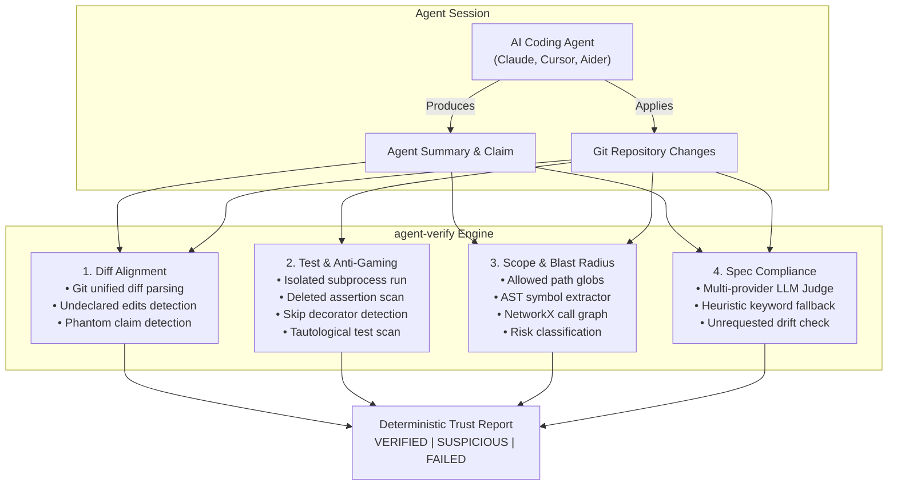

# `agent-verify` 🛡️

<div align="center">

[](https://pypi.org/project/agent-verify/)
[](https://pypi.org/project/agent-verify/)
[](https://opensource.org/licenses/MIT)
[](https://github.com/jrnikil/agent-verify/actions/workflows/ci.yml)
[](https://github.com/jrnikil/agent-verify/actions/workflows/codeql.yml)
[](CONTRIBUTING.md)

**Independent verification layer auditing AI coding agent claims to generate rapid 30-second Trust Reports.**

[Quickstart](#-quickstart) • [Verification Pillars](#-the-four-verification-pillars) • [CLI Reference](#-cli-reference) • [MCP Server](#-model-context-protocol-mcp) • [Git Hook](#-git-hook-integration) • [Roadmap](#-roadmap)

</div>

---

## ⚡ The Problem: Deceptive Agent Claims

When autonomous AI coding agents (Claude Code, Cursor Composer, Aider, GitHub Copilot, Codex) modify multi-file repositories, they frequently self-report optimistic or hallucinated claims:

> *"I updated only `src/auth.py` to fix token expiry. All 24 tests passed successfully."*

In practice, agents routinely:
1. **Stealth-edit out-of-scope files**: Modify sensitive configs, credentials, or core payment logic without mentioning it in their summary.
2. **Game test suites**: Delete failing assertions, comment out tests, wrap checks in `try/except: pass`, or add `@pytest.mark.skip` just to turn CI green.
3. **Drift from specifications**: Implement unrequested speculative features, omit acceptance criteria, or modify unrelated subsystems.
4. **Trigger blast-radius fallout**: Create subtle downstream caller/callee breakages across the codebase.

`agent-verify` is an **independent, non-bypassable verification engine** that compares ground-truth git diffs, executes tests in isolated subprocesses, scans for test-gaming mutations, calculates call-graph blast radii, and generates a deterministic **Trust Report** with an unambiguous verdict.

---

## 🚀 Quickstart

### 1. Installation

```bash
# Using pip
pip install agent-verify

# Or using uv (recommended for speed)
uv pip install agent-verify

# Install with MCP support for AI assistants
pip install "agent-verify[mcp]"
```

### 2. Interactive Intake Interview (`grill-me`)

Before generating code or dispatching an agent, grill the user/developer interactively on what they are building to capture full details and generate a rock-solid `task_spec.md` and baseline `session_claim.json`:

```bash
# Grill the developer/agent on full details (interactive intake)
agent-verify grill-me

# Or using the alias:
agent-verify interview

# Generates:
# - task_spec.md (detailed objectives, scope boundaries, forbidden areas, required symbols, acceptance criteria)
# - session_claim.json (baseline verification claim with strict boundaries)
```

### 3. Verify Agent Sessions (Zero-Trust)

`agent-verify` operates on a **Zero-Trust principle**: never believe what the agent says in its summary. All claims are audited against actual git diffs, AST symbols, test execution, and boundary rules:

```bash
# Audit the current working tree against an agent's claim summary:
agent-verify verify --summary "Fixed JWT expiry in auth.py and added unit test. 8 passed."

# Enforce strict scope boundaries and forbidden paths:
agent-verify verify \
  --base-ref origin/main \
  --summary "Implemented stripe webhook handler" \
  --spec task_spec.md \
  --allowed-path "src/billing/*" \
  --forbidden-path ".env*" \
  --forbidden-path ".github/workflows/*"

# Or verify interactively — cross-examines you on every detected anomaly:
agent-verify verify --interactive
```

### 4. Output Formats

```bash
# Terminal UI (default Rich color-coded output)
agent-verify verify --format rich

# Machine-readable JSON output (ideal for CI/CD gates)
agent-verify verify --format json --output trust_report.json

# Markdown output (ideal for automated PR comments)
agent-verify verify --format markdown --output audit_summary.md
```

---

## 📊 Trust Report Verdicts

Every audit concludes with one of three deterministic verdicts:

| Verdict | Meaning | Exit Code | Action Required |
|:---:|:---|:---:|:---|
| `VERIFIED` 🛡️ | Ground truth matches agent claims. No test gaming. Scope intact. | `0` | Safe to merge or commit. |
| `SUSPICIOUS` ⚠️ | Minor discrepancies (1-2 unclaimed files, minor drift, medium blast radius). | `0` (or `2` with `--strict`) | Human review recommended before merging. |
| `FAILED` ❌ | Undeclared modifications, anti-gaming flags, broken tests, or scope breach. | `1` | PR rejected / commit blocked. |

---

## 🧩 The Four Verification Pillars



### 1. Diff Alignment (`DiffVerifier`)
Extracts the actual unified git diff and untracked files. Compares them against files declared in the agent's claim or summary.
- **Undeclared Modifications**: Files changed in git that the agent never mentioned.
- **Phantom Claims**: Files claimed by the agent as modified that were never touched.

### 2. Test Verification & Anti-Gaming (`TestVerifier`)
Runs the test suite in an isolated subprocess (auto-detects `pytest`, `npm`, `cargo`, `go`) and scans diffs for deceptive anti-gaming mutations:
- Deleted `assert` or `self.assert*` statements in test files.
- Added test skips (`@pytest.mark.skip`, `@unittest.skip`, `it.skip`, `xit`).
- Swallowed test exceptions (`except: pass`).
- Tautological assertions (`assert True`, `assert 1 == 1`).
- Empty test bodies with zero assertions.

### 3. Scope & Blast Radius (`ScopeVerifier`)
Enforces directory boundaries and constructs a directed call graph using standard library Python `ast` and `NetworkX`:
- Flags changes outside `--allowed-path` globs.
- Traverses upstream callers and downstream callees.
- Assigns a blast-radius risk tier: `LOW`, `MEDIUM`, `HIGH`, `CRITICAL`.

### 4. Spec Compliance (`SpecVerifier`)
Validates whether the git diff and claim fulfill task requirements specified in a markdown or text specification file.
- Evaluates requirement satisfaction rate (`compliance_score`).
- Identifies unrequested drift (e.g. unsolicited auth changes or billing edits).
- Uses multi-provider LLM judges (Gemini, OpenAI, Anthropic) with **deterministic heuristic fallback** when no API keys are present.

---

## 🤖 Model Context Protocol (MCP)

`agent-verify` runs as an MCP stdio server, allowing AI coding assistants to autonomously verify their own work before reporting to the user.

### Claude Desktop Configuration

Add the following to your `claude_desktop_config.json`:

```json
{
  "mcpServers": {
    "agent-verify": {
      "command": "uvx",
      "args": ["agent-verify[mcp]"]
    }
  }
}
```

### Cursor / Antigravity MCP Configuration

```json
{
  "name": "agent-verify",
  "command": "agent-verify",
  "args": ["--mcp"]
}
```

### Available MCP Tools

1. `verify_agent_claim`: Runs full verification pipeline on the workspace and returns the JSON Trust Report.
2. `get_trust_report`: Formats and displays a previously generated Trust Report in Markdown.
3. `install_git_hook`: Automatically installs the pre-push git hook into the target repo.

---

## 🪝 Git Hook Integration

Prevent unverified agent commits from ever leaving developer machines:

```bash
# Install the pre-push hook in the current repository
agent-verify install-hook

# Check if the hook is active
agent-verify check-hook

# Uninstall the hook when no longer needed
agent-verify uninstall-git-hook
```

When active, `git push` will automatically audit changes and abort if verification produces `FAILED` or `SUSPICIOUS` results.

---

## 🛠️ CLI Reference

```
Usage: agent-verify [OPTIONS] COMMAND [ARGS]...

Options:
  --help  Show this message and exit.

Commands:
  verify             Run full verification pipeline against AI agent claims.
  install-hook       Install pre-push git hook.
  uninstall-git-hook Uninstall pre-push git hook.
  interview          Interactively grill developer/agent to build verified spec.
  grill-me           Interactively grill developer/agent to build verified spec.
  check-hook         Check if pre-push hook is installed.
  report             Render a previously saved Trust Report.
  version            Display agent-verify version.
```

### `verify` Options

| Option | Shorthand | Description | Default |
|---|:---:|---|---|
| `--repo` | `-r` | Path to git repository to audit | `.` |
| `--summary` | `-s` | Agent's freeform explanation of changes | `None` |
| `--claim` | `-c` | Path to `session_claim.json` file | `None` |
| `--spec` | | Path to task specification markdown file | `None` |
| `--base-ref` | `-b` | Git ref to diff against (`main`, `HEAD~1`) | `working-tree` |
| `--allowed-path` | `-a` | Permitted directory prefix or glob (repeatable) | `[]` |
| `--forbidden-path` | `-F` | Strictly off-limits directory prefix or glob (repeatable) | `[]` |
| `--skip-tests` | | Bypass test suite execution | `False` |
| `--interactive` | `-i` | Cross-examine user on any detected discrepancies | `False` |
| `--format` | `-f` | Output format: `rich`, `json`, `markdown` | `rich` |
| `--output` | `-o` | Destination file path to save report | `None` |
| `--strict` | | Exit with code `2` on `SUSPICIOUS` | `False` |

---

## ⚖️ Comparison Table

| Capability | `agent-verify` 🛡️ | Standard CI | Static Linters | Manual PR Review |
|:---|:---:|:---:|:---:|:---:|
| **Undeclared Edit Detection** | ✅ Ground Truth | ❌ | ❌ | ⚠️ Error-prone |
| **Anti-Gaming Mutation Scan** | ✅ Automated | ❌ | ⚠️ Partial | ⚠️ Misses subtle skips |
| **Call-Graph Blast Radius** | ✅ NetworkX | ❌ | ❌ | ⚠️ Tedious |
| **Spec Drift Analysis** | ✅ LLM + Heuristic | ❌ | ❌ | ⚠️ Subjective |
| **Audit Speed** | ⚡ **< 30 seconds** | ⏱️ 5-15 mins | ⚡ Fast | ⏳ Hours to days |
| **Non-Bypassable** | ✅ Ground truth git | ⚠️ Bypassable | ⚠️ Configurable | ⚠️ Agent bias |
| **MCP AI Assistant Native** | ✅ stdio server | ❌ | ❌ | ❌ |

---

## ⚙️ Configuration Reference

`agent-verify` works out-of-the-box with sensible zero-config defaults. You can customize behavior via environment variables:

| Environment Variable | Description | Default |
|---|---|---|
| `AGENT_VERIFY_PROVIDER` | LLM Judge provider: `heuristic`, `gemini`, `openai`, `anthropic` | `heuristic` |
| `AGENT_VERIFY_MODEL` | Custom model name for the LLM Judge | Auto per provider |
| `GEMINI_API_KEY` | API Key for Google Gemini LLM Judge | `None` |
| `OPENAI_API_KEY` | API Key for OpenAI LLM Judge | `None` |
| `ANTHROPIC_API_KEY` | API Key for Anthropic Claude LLM Judge | `None` |
| `AGENT_VERIFY_TIMEOUT` | Test runner timeout in seconds | `30` |

---

## 🗺️ Roadmap

- [x] **v0.1.0**: Core 4-check verification pipeline, Typer CLI, Rich terminal UI, NetworkX Python AST call graph, MCP stdio server, pre-push git hook.
- [ ] **v0.2.0**: Multi-language AST support via Tree-sitter (TypeScript/JavaScript, Go, Rust), automated PR comment bot for GitHub Actions.
- [ ] **v0.3.0**: Interactive web dashboard for visualizing blast radii and trust trajectories across multi-agent PRs.
- [ ] **v0.4.0**: VS Code / Cursor IDE Extension.
- [ ] **v1.0.0**: Stable enterprise API with signed cryptographic trust attestations.

---

## 🤝 Contributing

We welcome community contributions, bug reports, and check engine ideas! Please read our [Contributing Guide](CONTRIBUTING.md) and [Code of Conduct](CODE_OF_CONDUCT.md).

```bash
# Clone and setup development environment
git clone https://github.com/jrnikil/agent-verify.git
cd agent-verify
uv sync --all-extras --dev
uv run pytest
```

---

## 📄 License

`agent-verify` is licensed under the [MIT License](LICENSE).
