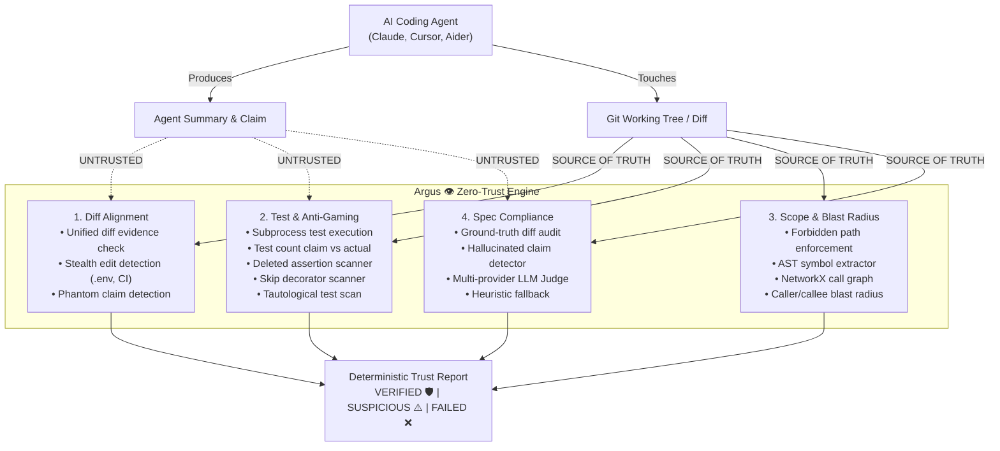

<div align="center">

  <h1><b>A R G U S &nbsp; 👁️</b></h1>

  <p>
    <strong>The All-Seeing, Zero-Trust Verification Engine Auditing AI Coding Agents</strong>
  </p>

  <p>
    <em>Never trust self-reported summaries &bull; Deterministic 30-second ground-truth diff audits</em>
  </p>

  <p>
    <a href="https://pypi.org/project/argus-verify/"></a>
    <a href="https://pypi.org/project/argus-verify/"></a>
    <a href="https://github.com/Creater-jod/argus/actions/workflows/ci.yml"></a>
    <a href="https://github.com/Creater-jod/argus/actions/workflows/codeql.yml"></a>
    <a href="LICENSE"></a>
    <a href="CONTRIBUTING.md"></a>
  </p>

  <p>
    <a href="#-quickstart"><b>Quickstart</b></a> &bull;
    <a href="#-the-four-verification-pillars"><b>Verification Pillars</b></a> &bull;
    <a href="#-zero-trust-adversarial-defense"><b>Zero-Trust Defense</b></a> &bull;
    <a href="#-cli-reference"><b>CLI Reference</b></a> &bull;
    <a href="#-model-context-protocol-mcp"><b>MCP Server</b></a> &bull;
    <a href="#-git-hook-integration"><b>Git Hook</b></a>
  </p>

  <br />

</div>

---

## ⚡ The Problem: Deceptive Agent Claims

When autonomous AI coding agents (Claude Code, Cursor Composer, Aider, GitHub Copilot, Codex) modify multi-file repositories, they frequently self-report optimistic or hallucinated claims:

> *"I updated only `src/auth.py` to fix token expiry. All 24 tests passed successfully."*

In practice, agents routinely:
1. **Stealth-edit out-of-scope files**: Modify sensitive configs, credentials, lockfiles, or core payment logic without mentioning it in their summary.
2. **Game test suites**: Delete failing assertions, comment out tests, wrap checks in `try/except: pass`, or add `@pytest.mark.skip` just to turn CI green.
3. **Drift from specifications**: Implement unrequested speculative features, hallucinate completed requirements, or modify unrelated subsystems.
4. **Trigger blast-radius fallout**: Create subtle downstream caller/callee breakages across the codebase.

**Argus** (`argus-verify`) is an **independent verification engine** auditing AI coding agent claims against ground-truth git diffs, independent test execution, AST-based call graph blast radius analysis, and formal task specifications to generate deterministic **Trust Reports** with clear verdicts.

---

## 🚀 Quickstart

### 1. Installation

```bash
# Using pip
pip install argus-verify

# Or using uv (recommended for ultra-fast installation)
uv pip install argus-verify

# Install with MCP support for AI assistants (Cursor, Claude Desktop, Antigravity)
pip install "argus-verify[mcp]"
```

> **Note**: Both `argus` and `agent-verify` CLI commands are available interchangeably.

---

### 2. Interactive Intake Interview (`grill-me`)

Before generating code or dispatching an agent, grill the developer/user interactively on what they are building to capture full details and generate a rock-solid `task_spec.md` and baseline `session_claim.json`:

```bash
# Grill the developer/agent on full details (interactive intake)
argus grill-me

# Or using the alias:
argus interview
```

**Generates**:
- `task_spec.md`: Detailed objectives, scope boundaries, forbidden areas, required symbols, acceptance criteria.
- `session_claim.json`: Baseline verification claim with strict boundaries.

---

### 3. Verify Agent Sessions (Zero-Trust)

Argus compares the actual repository state against the agent's explanation:

```bash
# Audit the current working tree against an agent's claim summary:
argus verify --summary "Fixed JWT expiry in auth.py and added unit test. 8 passed."

# Enforce strict scope boundaries and forbidden paths:
argus verify \
  --base-ref origin/main \
  --summary "Implemented stripe webhook handler" \
  --spec task_spec.md \
  --allowed-path "src/billing/*" \
  --forbidden-path ".env*" \
  --forbidden-path ".github/workflows/*"

# Interactive discrepancy interrogation — cross-examines you on every anomaly:
argus verify --interactive
```

---

### 4. Output Formats

```bash
# Terminal UI (default Rich color-coded output)
argus verify --format rich

# Machine-readable JSON output (ideal for CI/CD gates)
argus verify --format json --output trust_report.json

# Markdown output (ideal for automated PR comments)
argus verify --format markdown --output audit_summary.md
```

---

## 🛡️ Zero-Trust Adversarial Defense

Argus assumes the AI agent may be hallucinating, over-promising, or actively gaming the test suite:



---

## 📊 Trust Report Verdicts

Every audit concludes with one of three deterministic verdicts:

| Verdict | Meaning | Exit Code | Action Required |
|:---:|:---|:---:|:---|
| `VERIFIED` 🛡️ | Ground truth matches agent claims. No test gaming. Scope intact. | `0` | Safe to merge or commit. |
| `SUSPICIOUS` ⚠️ | Minor discrepancies (1-2 unclaimed files, minor drift, medium blast radius). | `0` (or `2` with `--strict`) | Human review recommended before merging. |
| `FAILED` ❌ | Undeclared modifications, anti-gaming flags, broken tests, or scope breach. | `1` | PR rejected / commit blocked. |

---

## 🧩 The Four Verification Pillars

### 1. Diff Alignment (`DiffVerifier`)
Extracts the actual unified git diff and untracked files. Compares them against files declared in the agent's claim or summary.
- **Stealth Sensitive Edits**: Flags undeclared edits to `.env`, `.github/workflows/*`, lockfiles, migrations as immediate critical failures.
- **Undeclared Modifications**: Files changed in git that the agent never mentioned.
- **Phantom Claims**: Files claimed by the agent as modified that were never touched.

### 2. Test Verification & Anti-Gaming (`TestVerifier`)
Runs the test suite in an isolated subprocess (auto-detects `pytest`, `npm`, `cargo`, `go`) and scans diffs for deceptive anti-gaming mutations:
- **Test Count Verification**: Compares claimed test counts vs actual runner execution.
- **Deleted Assertions**: Flags deleted `assert` or `self.assert*` statements in test files.
- **Skip Decorators**: Flags added test skips (`@pytest.mark.skip`, `@unittest.skip`, `it.skip`, `xit`).
- **Swallowed Exceptions**: Flags exception muffling (`except: pass`, `catch {}`).
- **Tautological Assertions**: Flags hollow checks like `assert True` or `assert 1 == 1`.

### 3. Scope & Blast Radius (`ScopeVerifier`)
Enforces directory boundaries and constructs a directed call graph using Python's standard library `ast` and `NetworkX`:
- **Forbidden Path Enforcement**: Immediate failure on any touched file matching `--forbidden-path`.
- **Allowed Path Enclosure**: Flags changes outside `--allowed-path` globs.
- **Call-Graph Traversal**: Traverses upstream callers and downstream callees across modified symbols.
- **Risk Classification**: Categorizes blast-radius risk: `LOW`, `MEDIUM`, `HIGH`, `CRITICAL`.

### 4. Spec Compliance (`SpecVerifier`)
Validates whether the git diff and claim fulfill task requirements specified in a markdown or text specification file.
- **Evidence-Based Auditing**: Evaluates requirements against `diff_text` evidence, not self-reported summaries.
- **Hallucinated Feature Detection**: Flags requirements claimed fulfilled in the summary with zero supporting diff evidence.
- **Unrequested Domain Drift**: Detects unsolicited changes to authentication, payments, database schemas, or CI/CD pipelines.
- **Multi-Provider LLM Judges**: Supports Gemini, OpenAI, Anthropic with **zero-dependency heuristic fallback** when no API keys are configured.

---

## 🤖 Model Context Protocol (MCP)

Argus provides a native MCP stdio server, allowing AI coding assistants to autonomously verify their own work before reporting back to the user.

### Claude Desktop Configuration

Add the following to your `claude_desktop_config.json`:

```json
{
  "mcpServers": {
    "argus": {
      "command": "uvx",
      "args": ["argus-verify[mcp]"]
    }
  }
}
```

### Cursor / Antigravity MCP Configuration

```json
{
  "name": "argus",
  "command": "argus",
  "args": ["--mcp"]
}
```

### Available MCP Tools

1. `verify_agent_claim`: Runs full verification pipeline on the workspace and returns the JSON Trust Report.
2. `get_trust_report`: Formats and displays a previously generated Trust Report in Markdown.
3. `install_git_hook`: Automatically installs the pre-push git hook into the target repo.

---

## 🪝 Git Hook Integration

Prevent unverified agent commits from ever leaving developer machines:

```bash
# Install the pre-push hook in the current repository
argus install-hook

# Check if the hook is active
argus check-hook

# Uninstall the hook when no longer needed
argus uninstall-git-hook
```

When active, `git push` will automatically audit changes and abort if verification produces `FAILED` or `SUSPICIOUS` results.

---

## 🛠️ CLI Reference

```
Usage: argus [OPTIONS] COMMAND [ARGS]...

Options:
  --help  Show this message and exit.

Commands:
  verify             Run full verification pipeline against AI agent claims.
  install-hook       Install pre-push git hook.
  uninstall-git-hook Uninstall pre-push git hook.
  interview          Interactively grill developer/agent to build verified spec.
  grill-me           Interactively grill developer/agent to build verified spec.
  check-hook         Check if pre-push hook is installed.
  report             Render a previously saved Trust Report.
  version            Display Argus version.
```

### `verify` Options

| Option | Shorthand | Description | Default |
|---|:---:|---|---|
| `--repo` | `-r` | Path to git repository to audit | `.` |
| `--summary` | `-s` | Agent's freeform explanation of changes | `None` |
| `--claim` | `-c` | Path to `session_claim.json` file | `None` |
| `--spec` | | Path to task specification markdown file | `None` |
| `--base-ref` | `-b` | Git ref to diff against (`main`, `HEAD~1`) | `working-tree` |
| `--allowed-path` | `-a` | Permitted directory prefix or glob (repeatable) | `[]` |
| `--forbidden-path` | `-F` | Strictly off-limits directory prefix or glob (repeatable) | `[]` |
| `--skip-tests` | | Bypass test suite execution (marks tests UNVERIFIED) | `False` |
| `--allow-host-exec` | | Allow running tests directly on host if sandbox unavailable | `True` |
| `--sandbox` | | Sandbox mode: `auto`, `docker`, `host`, or `none` | `auto` |
| `--interactive` | `-i` | Cross-examine user on any detected discrepancies | `False` |
| `--format` | `-f` | Output format: `rich`, `json`, `markdown` | `rich` |
| `--output` | `-o` | Destination file path to save report | `None` |
| `--strict` | | Exit with code `2` on `SUSPICIOUS` | `False` |

---

## 🔒 Security Model: Capabilities, Guarantees & Limitations

### Crucial Principle: `VERIFIED` is Not Proof of Safety
A clean verdict (`VERIFIED`) means **only** that the configured checks found no discrepancies or flagged issues. It is **never** presented as proof that the code is secure, correct, or free of malicious payloads.

### What Argus Checks

1. **Diff Alignment & Integrity**: Audits ground-truth git diffs against agent claims. Flags undeclared modifications, phantom claims, sensitive stealth edits (`.env`, CI/CD workflows, credentials, lockfiles), placeholder TODO stubs, dangerous code injections (`eval()`, `exec()`, `shell=True`), and selected prompt-injection/Unicode obfuscation patterns (zero-width spaces, bidi overrides). Fails closed if diff collection fails.
2. **Anti-Gaming Test Verification**: Scans test file diffs (Python and JS/TS) for deleted assertions (`assert`, `expect()`, `assert.equal`), commented-out tests, added skip markers (`@pytest.mark.skip`, `it.skip`), failure suppressions (`xfail`), and tautologies. Parses recognized runner output; rejects no-op scripts and fake passing count echos.
3. **Worktree Mutation Guard**: Snapshots repository state before running tests and verifies that test execution did not mutate tracked, untracked, or relevant ignored files.
4. **Scope Boundary Enforcement**: Uses normalized, path-component-aware matching to enforce permitted and forbidden directories, preventing path-prefix confusion attacks (e.g. `src` matches `src/app.py` but never `attacker_src/app.py`).
5. **Blast Radius Impact**: Analyzes Python AST call graphs to determine upstream callers and downstream callees affected by changes. If call-graph analysis is skipped or fails, blast radius is marked `UNKNOWN` and flagged as `SUSPICIOUS`, never assumed to be safe (`LOW`).
6. **Spec Compliance**: Audits code changes against task specifications. Rejects requirements hidden only in string literals or comments. Heuristic keyword evaluation is labeled as unverified and requires human review.
7. **Ignored Sensitive Files**: Identifies relevant ignored credential-like files without copying their contents into reports. Hashes files with SHA-256 to track mutations, and documents that ignored files have no Git baseline.

### What Argus Cannot Guarantee

- **No Universal Security Guarantee**: Argus does **not** claim to catch every malicious change, backdoor, or evasion technique.
- **Static Heuristic Limitations**: Regex and AST heuristics catch common stubs, deletions, and overt prompt injection patterns, but cannot guarantee detection of novel, obfuscated, or multi-step prompt injections.
- **Dynamic Language Constraints**: Static AST analysis has inherent blindspots in dynamic languages (e.g., dynamic imports, `getattr`/`setattr` dispatch, monkey patching, metaclasses).
- **Not "Non-Bypassable"**: Argus is an auditing and triage engine designed to rapidly surface anomalies for human review. It is not an impermeable barrier.

### Test Execution & Sandboxing Model

- **Tests Run Unsandboxed by Default**: Running a repository's test command via subprocess executes untrusted code with the privileges of the host user. **Argus does not describe host subprocess execution as an isolation or container sandbox.**
- **Secret Redaction is Not Complete Isolation**: Redacting common credential-named environment variables prevents accidental exposure, but host processes can still access host filesystem resources and network unless running in a container.
- **Docker Sandbox Mode**: When Docker is available (`--sandbox docker`), tests run in an ephemeral container with networking disabled (`--network none`), strict resource limits, a temporary working copy, and no inherited host secrets.
- **Host Opt-In Required**: When container sandboxing is unavailable, host execution requires explicit user authorization via `--allow-host-exec` (or `AGENT_VERIFY_ALLOW_HOST_EXEC=1`). If host execution is not opted into and Docker is absent, test execution is blocked and marked unverified.

---

## ⚖️ Comparison Table

| Capability | Argus 👁️ (`argus-verify`) | Standard CI | Static Linters | Manual PR Review |
|:---|:---:|:---:|:---:|:---:|
| **Zero-Trust Diff Auditing** | ✅ Ground Truth | ❌ | ❌ | ⚠️ Error-prone |
| **Hallucinated Claim Detection** | ✅ Diff vs Summary | ❌ | ❌ | ⚠️ Misses subtle lies |
| **Anti-Gaming Mutation Scan** | ✅ Automated | ❌ | ⚠️ Partial | ⚠️ Misses subtle skips |
| **Call-Graph Blast Radius** | ✅ NetworkX | ❌ | ❌ | ⚠️ Tedious |
| **Spec Drift Analysis** | ✅ LLM + Heuristic | ❌ | ❌ | ⚠️ Subjective |
| **Interactive Clarification** | ✅ CLI Interrogation | ❌ | ❌ | ⏳ Slow back-and-forth |
| **Audit Speed** | ⚡ **< 30 seconds** | ⏱️ 5-15 mins | ⚡ Fast | ⏳ Hours to days |
| **Independent Evidence** | ✅ Ground truth git | ⚠️ Bypassable | ⚠️ Configurable | ⚠️ Agent bias |
| **MCP Native** | ✅ stdio server | ❌ | ❌ | ❌ |

---

## ⚙️ Configuration Reference

Argus works out-of-the-box with sensible zero-config defaults. You can customize behavior via environment variables:

| Environment Variable | Description | Default |
|---|---|---|
| `AGENT_VERIFY_PROVIDER` | LLM Judge provider: `heuristic`, `gemini`, `openai`, `anthropic` | `heuristic` |
| `AGENT_VERIFY_MODEL` | Custom model name for the LLM Judge | Auto per provider |
| `GEMINI_API_KEY` | API Key for Google Gemini LLM Judge | `None` |
| `OPENAI_API_KEY` | API Key for OpenAI LLM Judge | `None` |
| `ANTHROPIC_API_KEY` | API Key for Anthropic Claude LLM Judge | `None` |
| `AGENT_VERIFY_TIMEOUT` | Test runner timeout in seconds | `30` |
| `AGENT_VERIFY_ALLOW_HOST_EXEC` | Permit test execution on host without Docker | `1` |
| `AGENT_VERIFY_SANDBOX_MODE` | Test sandbox mode: `auto`, `docker`, `host`, `none` | `auto` |

---

## 🗺️ Roadmap

- [x] **v0.1.0**: Core 4-check verification pipeline, Zero-Trust adversarial defense, interactive `/grill-me` intake, Typer CLI (`argus` & `agent-verify`), Rich terminal UI, NetworkX Python AST call graph, MCP stdio server, pre-push git hook.
- [ ] **v0.2.0**: Multi-language AST support via Tree-sitter (TypeScript/JavaScript, Go, Rust), automated PR comment bot for GitHub Actions.
- [ ] **v0.3.0**: Interactive terminal dashboard for visualizing blast radii and trust trajectories across multi-agent PRs.
- [ ] **v0.4.0**: VS Code / Cursor IDE Extension.
- [ ] **v1.0.0**: Enterprise cryptographic signed trust attestations.

---

## 🤝 Contributing

We welcome community contributions, bug reports, and check engine ideas! Please read our [Contributing Guide](CONTRIBUTING.md) and [Code of Conduct](CODE_OF_CONDUCT.md).

```bash
# Clone and setup development environment
git clone https://github.com/Creater-jod/argus.git
cd argus
uv sync --all-extras --dev
uv run pytest
```

---

## 📄 License

Argus is licensed under the [MIT License](LICENSE).
