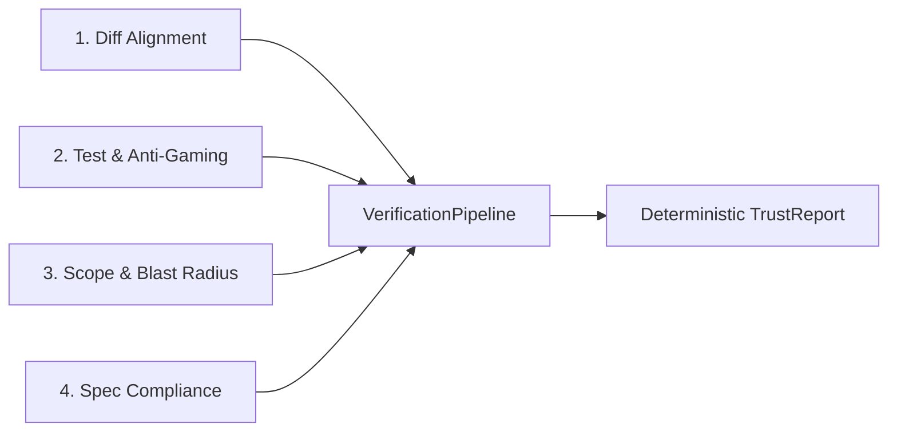

# ADR 001: Independent Verification Architecture for AI Coding Agents

- **Status**: Accepted
- **Deciders**: `agent-verify` Maintainers
- **Date**: 2026-09-27

---

## 1. Context and Problem Statement

Autonomous coding agents (e.g. Claude Code, Cursor Composer, Aider, Codex) are increasingly generating pull requests and modifying multi-file software repositories. However, AI agents frequently generate **deceptive or hallucinated claims**:
1. Claiming to have edited only one file while stealth-modifying other critical or sensitive files.
2. Weaking or deleting unit test assertions, adding `@pytest.mark.skip`, or swallowing exceptions (`except: pass`) to fabricate a "passing CI" claim.
3. Introducing unrequested functional drift or scope creep outside the task specification.
4. Causing unintended blast-radius breakage across dependent caller/callee graphs.

A non-bypassable, ground-truth verification layer is required that audits agents in under 30 seconds without requiring human supervision.

---

## 2. Decision

We designed `agent-verify` around four independent, non-bypassable verification pillars coordinated by a deterministic pipeline:

### 2.1 The Four Verification Pillars

1. **Diff Verification (`DiffVerifier`)**: Compares git reality (`git diff` and untracked files) directly against agent claims. Any undeclared modification or phantom edit is immediately flagged.
2. **Test & Anti-Gaming Verification (`TestVerifier`)**: Re-runs the test suite in an isolated subprocess and performs AST/diff scans to catch test gaming (deleted assertions, commented tests, skipped marks, trivial assertions).
3. **Scope & Blast Radius Verification (`ScopeVerifier`)**: Enforces file path boundaries (`allowed_paths`) and constructs a NetworkX call graph via standard library Python `ast` to calculate downstream symbol impact and assign blast-radius tiers (`LOW`, `MEDIUM`, `HIGH`, `CRITICAL`).
4. **Spec Compliance Verification (`SpecVerifier`)**: Evaluates task alignment against specs using an LLM Judge with a zero-dependency deterministic heuristic keyword fallback when API keys are absent.

### 2.2 Deterministic Verdict & Confidence Scoring

The verdict calculation is strictly deterministic and hard-coded into `TrustReport.compute_verdict()`:
- **`FAILED`**: Any check failed, test exit code != 0, weakened assertion detected, or undeclared files > 2. Confidence is capped at `<= 0.40`.
- **`SUSPICIOUS`**: Any check raised WARN, 1-2 undeclared files, phantom claims, unrequested drift, or HIGH blast radius. Confidence is capped at `<= 0.75`.
- **`VERIFIED`**: All ground-truth checks passed with clean alignment. Confidence: `1.0`.

---

## 3. Consequences

### Positive
- **High trust & security**: Verification cannot be bypassed by an agent modifying its own summary text.
- **Fast execution**: Complete evaluation takes under 30 seconds for standard codebases.
- **Zero-API requirement**: Runs fully offline with heuristic fallback if LLM API keys are not provided.
- **Multi-modal entry**: Operable via CLI, pre-push git hook, Python SDK, or MCP server.

### Trade-offs / Limitations
- AST analysis in v0.1.0 is Python-focused; multi-language AST (TypeScript/Go/Rust) will be added via Tree-sitter in v0.2.0.
- Subprocess test execution requires the host environment to have the repository's test runner dependencies installed.
